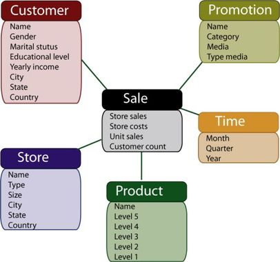
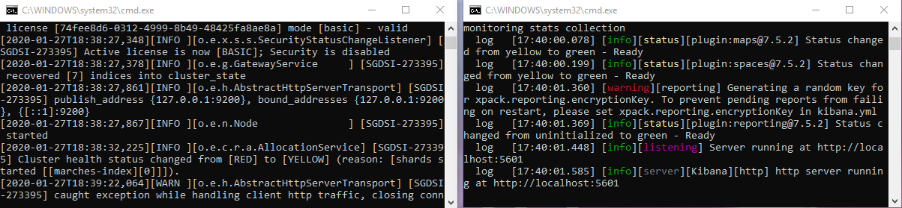
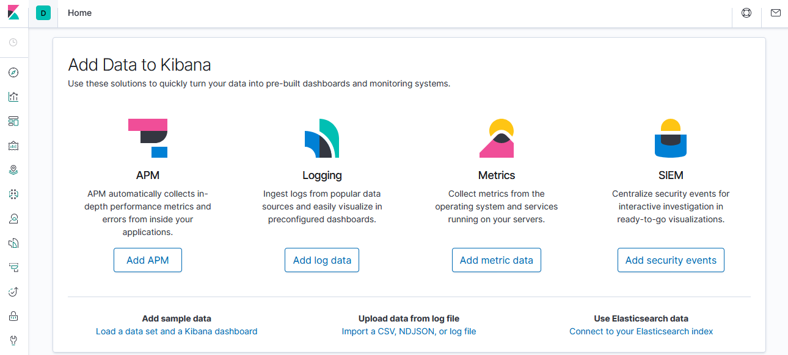
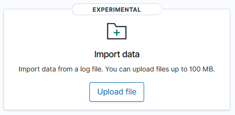
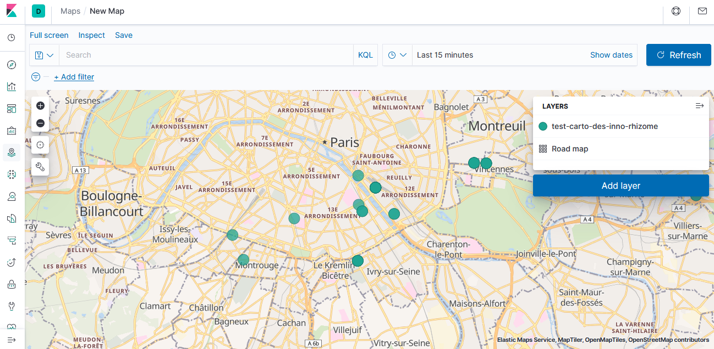
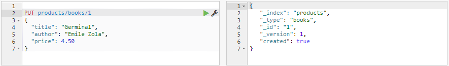
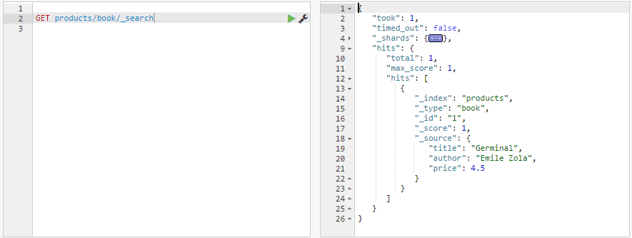

# Débuter avec Elasticsearch (et Kibana) : sensibilisation en 2h30

# Brisons la glace !

* Bienvenue...
* Et si on faisait connaissance ? C'est le moment du jeu... 


# Une formation Elasticsearch ? 

## Commençons par poser le décor !
* De plus en plus d'informations produites chaque jour
* Des informations sous tout format, parfois sans format
* Une société du chiffre et des tableaux de bord
* Nécessaire de stocker une information volumineuse, de plus en plus en temps réel
* Pouvoir rechercher une information précise : l'aiguille dans la botte de foin
* Produire des tableaux de bord performants et justes

## Retour en arrière



* Des données stockées dans des bases de données relationnelles : des tables, des clefs primaires et secondaires, etc.
* Un accès simple et rapide sous réserve de construire la requête qui va joindre les tables concernées
* MAIS la rapidité de la réponse dépend de la volumétrie de la base.

## Retour vers le futur (=aujourd'hui)
* Une nouvelle organisation de l'information est possible / proposée pour répondre aux besoins du bigdata.
* Elasticsearch est une solution possible.
* Bien entendu, les éditeurs historiques travaillent aussi à de nouveaux modèles.

## Elastic ?  Ca va encore me sauter dans l'œil !
* Un moteur de stockage et de recherche de données relativement puissant pour le bigdata
* Basé sur Lucène, un des nombreux projets d'Apache Software Foundation
* Développé en Java
* Distribué en source sous licence Apache 2.0 (certaines fonctionnalités avancées nécessitent une licence Entreprise)
* Principe simple : une information stockée dans des "documents" (au format JSON), un moteur de recherche "full-text" et un accès aux données via des  appels au format API RESTFul
* Architecture possible : des nœuds qui se synchronisent automatiquement pour pallier toute défaillance

 
## En synthèse
Elasticsearch est :
* un outil de stockage de données et un moteur de recherche 
* APIsé
* adpaté aux données de type _bigdata_, mais pas que...
* open source

## Oui mais un moteur c'est pour les _techos_ ?
* Elastic peut être utilisé seul dans des architectures de complexités variées.
* Elastic ne sort jamais sans son ami Kibana. 
* Kibana est un outil de visualisation de données greffé à Elasticsearch, publié en opensource sous Licence Apache 2.0. 
* Exemples de graphiques disponibles sous Kibana : diagrammes en barre, en ligne, des nuages de points, des camemberts et des cartes...
* Les différentes représentations de données sont assemblées dans des tableaux de bord.

## Exemples aux Armées


# Stop blabla, passage à l'action !

## On se concentre...

Dans un premier temps : nous allons charger un jeu de données, puis créer quelques indicateurs et un tableau de bord.
* Une "mini" architecture ELK est disponible sur votre PC et elle contient un jeu de données à charger. Ces composants sont téléchargeables sur le site d'Elasticsearch https://elastic.co. Pour une installation simple et sans nécessité des droits d'administration, prendre les fichiers `ZIP`.
* L'objectif de ce pas-à-pas est de découvrir Elasticsearch et Kibana par leurs fonctionnalités de chargement et de visualisation.

Dans un second temps : nous poursuivrons avec un zoom sur les avantages d'une telle solution.
Et en fonction du temps restant, nous testerons le chargement d'un autre jeu de données au format `CSV`.


## Débuter pas à pas avec Elastic+Kibana = ELK
Avant de conduire, il faut démarrer la voiture ! Commençons donc par démarrer l'architecture ELK disponible.

* Démarrer **Elasticsearch** : se positionner dans le répertoire `elastic\bin` et double-cliquer sur la commande `elasticsearch.bat`
* Démarrer **Kibana** : se positionner dans le répertoire `kibana\bin` et double-cliquer la commande suivante `kibana.bat`
* Vous avez maintenant deux fenêtres qu'il ne faut *SURTOUT* pas fermer. Elles permettent de voir si l'architecture ELK fonctionne bien. Les mettre côte-à-côte pour suivre les messages qui s'afficheront. Inutile de tout lire. En cas d'erreurs, des messages plus ou moins explicites s'affichent avec le mot clef `ERROR` ; ils permettent de corriger les actions (c'est tout de même le mode *développeur-geek*).



* Le démarrage de l'architecture peut prendre plus ou moins de temps en fonction de la "puissance" du poste de travail (entre 5 et 30 secondes). Donc patientez un peu...
* Lancer le navigateur et saisir l'adresse : http://localhost:5601/. Si l'architecture n'est pas encore prête, un message l'indique.



## Intégrer des données dans ELK

* Plusieurs solutions sont possibles pour intégrer des données dans le moteur Elasticsearch : 
  * **Ecrire du code**, en Python (langage de prédilection des datascientists), en R, en Java, etc.
  * **Utiliser un ETL** (extract-transform-load), comme Logstash autre greffon d'Elasticsearch
  * Utiliser une **fonction de Kibana** encore expérimentale
* La première est fortement recommandée pour bien maîtriser la manière dont les données seront intégrées. 
* Les autres solutions proposent moins de possibilités, mais sont très pratiques pour débuter.

## Chargement d'un fichier avec Python

Pour les plus geeks d'entre nous, un exemple d'un script qui lit les données d'un fichier `CSV`, fait une conversion d'une chaîne de caractères en numérique, puis intègre les données dans Elasticsearch.

```
from elasticsearch import helpers, Elasticsearch
import csv
import pandas as pd

es = Elasticsearch()

mydata = pd.read_csv('fichier des effectifs.csv', sep=';')
mydata['EFFECTIF'] = pd.to_numeric (mydata['EFFECTIF'])

documents = mydata.to_dict(orient='records')
helpers.bulk(es, documents, index='my-index', doc_type='_doc')
```

## Chargement d'un fichier avec Logstash

* Examiner le fichier `logstash-mp.conf` dans le répertoire `logstash`. Vous pouvez utiliser l'outil **Notepad++**.
* Dans une nouvelle fenêtre `cmd`, exécuter la commande suivante : `bin\logstash.bat -f config\logstash-mp.conf`
* Revenir au navigateur, aller à l'adresse http://localhost:5601/ puis cliquer sur l'icône boussole (en haut à gauche) (en anglais _discover_). Que voyez-vous ?
* Cliquer sur le dernier icône (en bas à gauche), puis sur `index management`. Que voyez-vous ?
* Cliquer ensuite sur `index patterns`. Créer un nouvel index pattern. 
* Revenir sur l'icône boussole. Que voyez-vous ?

## Chargement d'un fichier avec Kibana

* Se positionner sur le menu `Machine learning` de Kibana et cliquer sur `import data`



* Faire un `drag and drop` du fichier directement dans la zone dédiée de Kibana
* Kibana réalise une analyse rapide du fichier déposé. À ce stade, les données ne sont pas encore indexées. 
* Cliquer sur `import` et donner un nom à l'index
* Cliquer sur `import`
* Les données sont cette fois-ci intégrées dans Elasticsearch.
* Pour vérifier, cliquer sur `management`, puis sur `index management`. L'index est maintenant présent. Idem sur `index patterns`


## Bravo ! 
Vous avez chargé votre premier fichier dans Elastic ! Vous avez mérité une pause _selfy_ avec votre voisin/e.

## En synthèse
Pour intégrer des données :
* **plusieurs** solutions sont possibles : coder, paramètrer ou cliquer 
* le choix dépend de la **maîtrise souhaitée** des données
* exécuter ELK sur un poste de travail **sans droit d'administration** : c'est possible ! 


## Créer un premier indicateur

Les marchés publics de l'État depuis 2013 sont maintenant chargés. Waouh. Impressionné/e ? Vous n'avez encore rien vu. 

* Aller dans le menu `Visualize` (en haut à gauche, en dessous de la boussole).
* Cliquer sur `create visualisation`
* Vingt types de représentations sont proposées : des barres horizontales ou verticales, des camemberts, des compteurs, des cartes, des nuages de mots, etc.
* Choisir `metric`, puis choisir l'index pattern créé précédemment
* Par défaut, l'outil propose un comptage. Cliquer sur `metric`pour ouvrir les paramètres de l'indicateur. La fonction utilisée est `count`. Il s'agit donc du nombre de marchés qui ont été chargés depuis le fichier.
* Dans la zone `custom label`, saisir le mot `marchés` et cliquer sur le petit pictogramme qui rappelle la lecture sur la radiocassette... (triangle blanc sur fond bleu). Que se passe-t-il ? 
* Cliquer sur `save`, choisir un nom (explicite pour s'y retrouver).
* Cliquer sur l'icône `visualize` de la barre à gauche. Votre indicateur est maintenant créé.


## Créer un deuxième indicateur

* Refaire la partie précédente, mais cette fois-ci, choisir les barres verticales.
* Choisir la fonction `sum` au lieu de `count`
* Choisir la variable `montant`, cliquer sur "lecture", que se passe-t-il ? 
* Choisir la variable `nature du marché` pour l'axe des abscisses (X) : la fonction d’agrégation doit être `term` (car on souhaite faire une somme des montants par nature des marchés). Cliquer sur "lecture".
* Sauvegarder ce deuxième indicateur.

## Un petit dernier ? Créer un troisième indicateur

Cette fois-ci, choisir le nuage de mots comme représentation et la variable `attributaire`.
N'oubliez pas de sauvegarder.


## Création d'un premier tableau de bord

Nous y sommes presque !

* Aller dans le menu `Dashboard` (en haut à gauche, en dessous de Visualize).
* Cliquer sur `create dashboard`
* Le tableau de bord est vide. Il faut ajouter les différents indicateurs créés précédemment. Cliquer sur `add` et ajouter les trois représentations.
* Les représentations sont ajoutées au tableau de bord. Vous pouvez maintenant les ajuster pour organiser votre tableau de bord.

## Bravo !!

Vous devriez avoir quelque chose qui ressemble à ceci.
(image)
Vous avez mérité une pause...

# Zoom sur quelques fonctions essentielles d'Elasticsearch

## Analyse multidimensionnelle

* Un tableau de bord **riche** : possible de choisir plusieurs indicateurs (et donc plusieurs axes d'analyse) de _1_ ou _plusieurs_ index patterns

## Contextualisation
* Outil fortement **paramétrable** : chaque indicateur, chaque tableau de bord peut être adapté aux besoins métiers.
* Possibilité de définir des **droits d'accès** différents aux données, indicateurs et tableaux de bord (pour des besoins de confidentialité ou de secret)
* Possibilité d'interdire certaines recherches (sur mots-clefs ou sur critère de précision)


## Exploration des données

* Tableau de bord **dynamique** permettant de zoomer au gré des sélections pour aller du général au particulier
* Moteur de **recherche** _full-text_ qui permet de présenter un tableau de bord en l'adaptant aux résultats de la recherche


## Cartographie

* Créer des cartes à partir de données géolocalisées ou des données spatialisées



## Indexer un document

* Pour Elasticsearch, indexer revient à créer ou modifier un document. Indexer un document avec un _type_ et un _id_ qui n'existe pas déjà est une création. S'ils existent, c'est une modification (un remplacement).
* Indexer un document : c'est une requête `PUT` à l'API d'Elasticsearch sur une URL composée du nom de l'index, du type de document et de son id. Par exemple : `http://localhost:9200/<index>/<type>/<id>`



* Une fois cet appel réalisé, Elastic confirme que le nouveau document a bien été créé.
* Confiance n'exlut pas contrôle. Pour vérifier, une requête `GET` sur l'API permet de lister les livres indexés : `http://localhost:9200/products/book/_search`



## Autres API d'Elasctic

* Fonction `DELETE` de l'API : pour supprimer un document, un lot de documents, un index

```
curl -XDELETE http://localhost:9200/<index>/<type>/<id>
curl -XDELETE http://localhost:9200/<index>
```

# Conclusion

* Elastic : un **moteur d'indexation** puissant, souple, requêtable via des API, sécurisé et opensource.
* Kibana : un **outil de visualisation des données**, greffé à Elasticsearch, opensource et dynamique, qui permet d'importer acec peu d'effort des données.
* Logstash : un outil d'**aide au chargement de données** sans réellement programmer.
* Python : un **langage de développement** pour intégre des données avec grande maîtrise
* Ces quatre outils forment une **suite particulièrement performante** pour explorer des données de manière plus efficace que des outils de bureautique comme Calc ou Excel.
* Ils sont utilisables sur un poste de travail standard sans droits d'administration. **MAIS** cette mise en oeuvre ne doit être réservée qu'à des fins de tests ou de montée en connaissance. Pour des besoins d'exploitation pérenne, il est nécessaire de consulter vos correspondants dans vos DSI, qui pourront proposer des mises en oeuvres plus performantes que sur un poste de travail.


# Pour aller plus loin

* À votre écoute ! 


# Credits

## Images

* Capture écran de Data360 : Ministère des armées et ministères économiques et financiers

## Bibliographie

* https://www.elastic.co/fr/
* https://www.supinfo.com/articles/single/1418-introduction-elasticsearch
* https://www.elastic.co/fr/blog/importing-csv-and-log-data-into-elasticsearch-with-file-data-visualizer
* https://www.bmc.com/blogs/elasticsearch-load-csv-logstash/
* https://stackoverflow.com/questions/35253675/how-do-i-tell-elasticsearch-to-get-the-column-names-from-the-first-line-of-a-fil
* https://stackoverflow.com/questions/29297722/elasticsearch-converting-a-string-to-number